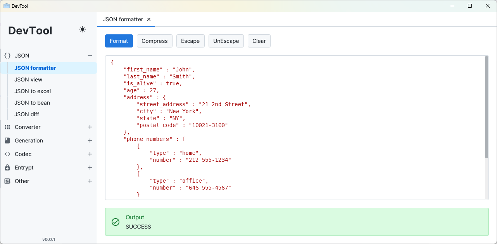

# DevTool

## Overview

DevTool provides a collection of handy tools for developers, built on JavaFX.



### Feature

- Provide a lot of useful tools for developers.
- A cross-platform application that supports Windows, macOS, Linux.
- Modern and beautiful GUI interface (thanks for [atlantafx](https://github.com/mkpaz/atlantafx/tree/master) project).

### Build With

- JDK 17
- JavaFX

## Build

```
git clone git@github.com:godshang/dev-tool.git
cd dev-tool
mvn clean package
```

## Try it out

Download the latest build on the [release page](https://github.com/godshang/dev-tool/releases).

## License

This project is under the [GNU GPLv3](LICENSE).